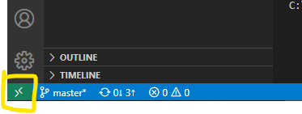
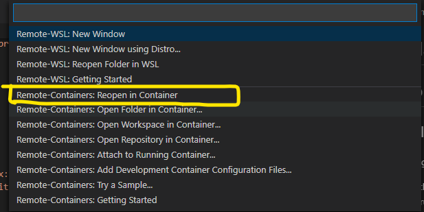
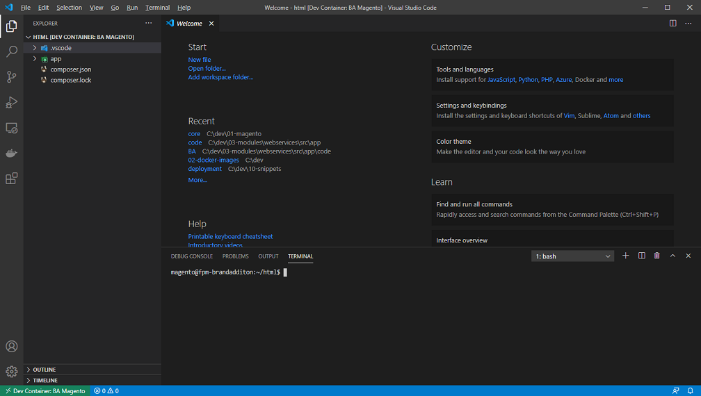
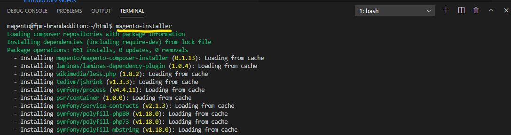

BA - Magento Core
=================

# Development Environment

## Services Available
With the enviroment running there are a number of services available to you to aid in development. 

These are:

* RabbitMQ Management - access at http://dev.brandadditionweb.com:15672/ 
    * username: magento
    * password: magento
* Mailhog - captures all emails sent from your local magento installation and can be accessed at http://dev.brandadditionweb.com:8025
* phpMyAdmin can be accessed at http://dev.brandadditionweb.com:8080
    * For more complex operations, I suggest you use a tool better suited for this such as: [HeidiSQL](https://www.heidisql.com/)

Tools available inside container:

* [Magerun](https://github.com/Space48/magedbm2) for greater control in magento cli operations
* [Magedbm2](https://github.com/Space48/magedbm2) for managing DB backups
* [Deployer](https://deployer.org/) for deployments.
* [Composer](https://getcompose.org/) for package management.
* [NPM](https://www.npmjs.com/) & [Grunt Task Runner](https://gruntjs.com/)
* [XDebug](https://xdebug.org/) - XDebug is pre-configured out of the box, to start the debugging process, simply press `CTRL + F5` inside the container.

## Pre-installation
Our development enviroment is based on Docker, and leverages VSCode Remote Containers to give us optimal performance and flexibility whilst developing. To begin developing, please follow the guidelines below.

Before starting the development enviroment, there are only a couple things things you will need to configure:

1. Install the [Remote - Containers](vscode:extension/ms-vscode-remote.remote-containers) extension on VSCode.
2. Rename `.env.sample` to `.env`
3. Confgirue `composer.env`

### Configuring composer.env
Rename `composer.env.sample` to `composer.env` & update the enviroment variables. The most important variables to update are `COMPOSER_MAGENTO_USERNAME` and `COMPOSER_MAGENTO_PASSWORD`, without these two set you will not be able to spin out the development enviroment. Please see below on how to locate/generate these tokens.

**Magento**

Magento tokens are **mandatory**, without them you will not be able to install the development environment

1. Log into your [Magento Marketplace Account.](https://marketplace.magento.com/customer/account)
2. Navigate to `My Products > Access Keys` 
3. Press `Create New Access Key` to create a key pair.
4. Update `composer.env`

```ini
# Magento Repo
COMPOSER_MAGENTO_USERNAME=YOURPUBLICKEY
COMPOSER_MAGENTO_PASSWORD=YOURPRIVATEKEY
```

**Github**

1. Log into [your github account](https://github.com/login)
2. Navigate to `Settings` (this can accessed by using the dropdown on your avatar in the top-right of the page).
3. Navigate to `Developer settings > Personal access tokens`
4. Press `Generate New Token`.
5. Give your token a name, select `read:packages` scope, and press `Generate token`.
6. Update `composer.env`

```ini
# GitHub
COMPOSER_GITHUB_OAUTH_TOKEN=1234567898001928392108321098302130213182 
```

**Bitbucket**

A bitbucket token is required to use `gateway3d/magento2-personaliseit2` and private brandaddtion repos. The easiest way to set this is by using your existing login details.

```ini
# Bit Bucket
COMPOSER_BITBUCKET_OAUTH_KEY=your.email@brandaddition.com
COMPOSER_BITBUCKET_OAUTH_SECRET=YourSup3rSecurePassword1243
```

## Startup & First Install

With everything configured, your good to go. 

**Entering Container**

Press the remote containers icon in the bottom left of VSCode:


Select `Remote-Containers: Reopen In Container`


This will load the a mounted workspace. 


**Installation**

In the terminal, type in `magento-installer` and let it run. 



If all has been configured correctly, you will have a development enviroment available to you at https://dev.brandaddition.com/

Happy hacking!

Issues will crop up with the enviroment, here are some common ones & the solutions for them:

## Nuke the Enviroment
Gotta nuke something! Nuking the enviroment and starting fresh can be done by:

**Windows CMD**

```
> docker-compose down --volumes && del /f /q src\app\etc\env.php
> docker-compose up -d --build && docker-compose exec --user=magento fpm magento-installer
```
**Bash**

```
./bin/nuke.sh && ./bin/start.sh
```

<!-- test commit -->